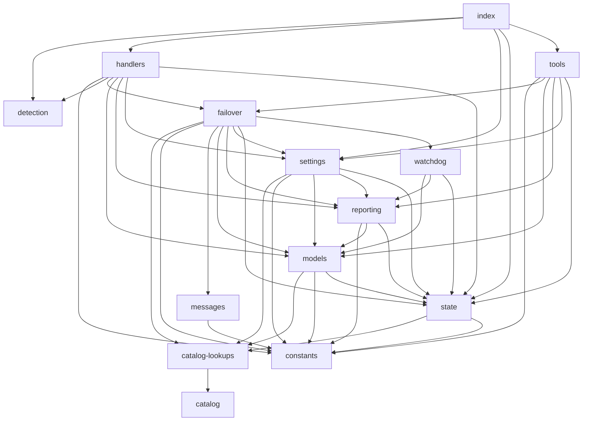

# Architecture

This document describes the module structure, event routing, and failover flow for `opencode-quota-failover`.

---

## Directory Structure

```
src/
  index.ts           Plugin entry point; wires handlers and tools
  types.ts           All shared TypeScript interfaces and type aliases
  constants.ts       Named constants: provider IDs, tiers, limits, file names
  catalog.ts         Static MODEL_CATALOG — every known model with tier, patterns, context window
  catalog-lookups.ts Derived lookup tables built from catalog at module load time
  models.ts          Runtime model resolution: tier inference, fallback chain, provider health
  state.ts           All shared mutable state: pending failovers, session maps, runtime settings
  settings.ts        Disk I/O for settings.json and failover.log
  detection.ts       Quota/rate-limit signal classifiers and retry backoff parser
  failover.ts        Failover orchestration: queueFailover, processFailover, runManualFailover
  handlers.ts        OpenCode event handler factories: chat.message, system.transform, event
  tools.ts           MCP tool definitions bound to plugin context
  reporting.ts       Status reports, toast messages, dispatch error summaries
  messages.ts        Message part conversion and replay user-message selection
  watchdog.ts        Stall watchdog timer: arms/disarms timeout-based failover
```

---

## Module Dependency Graph



> Edges show direct `import` relationships. `types.ts` is imported by many modules for type-only references and is omitted from the graph to reduce noise.

---

## Failover Flow Sequence

```mermaid
sequenceDiagram
    participant Event as OpenCode Event
    participant Handler as handlers.ts
    participant Detection as detection.ts
    participant Failover as failover.ts
    participant Models as models.ts
    participant Reporting as reporting.ts
    participant SDK as OpenCode SDK

    Event->>Handler: message.updated / session.error / session.status
    Handler->>Detection: shouldTriggerFailover(error, failedModel)
    Detection-->>Handler: true / false

    alt Definitive quota error detected
        Handler->>Failover: queueFailover(sessionID, payload)
        Handler->>Reporting: showDebugTriggerToast
        Note over Handler: session not yet idle; failover is queued
    end

    Event->>Handler: session.idle
    Handler->>Failover: processFailover(ctx, sessionID)

    Failover->>Models: pickFallback(failedModel, attemptedSet, tierHint)
    Models-->>Failover: target { providerID, modelID }

    Failover->>Reporting: buildFailoverToastMessage
    Failover->>SDK: ctx.client.tui.showToast (warning)
    Failover->>SDK: ctx.client.session.prompt (dispatch)

    alt Dispatch succeeds
        SDK-->>Failover: ok
        Failover->>Reporting: logFailoverEvent DISPATCH_OK
        Failover->>Watchdog: armStallWatchdog
    else Dispatch fails
        SDK-->>Failover: error
        Failover->>Reporting: categorizeDispatchError / dispatchErrorHint
        Failover->>SDK: ctx.client.tui.showToast (error + Reason/Category/Hint)
        Failover->>Models: pickFallback (next candidate)
    end
```

---

## Event Handling Overview

The plugin's `createEventHandler` in `handlers.ts` handles these six event types:

| Event | Handler action |
|---|---|
| `message.updated` | Updates `lastAssistantStatsBySession`. If the message has an error, runs `shouldTriggerFailover` with `requireDefinitive: true`. On match, calls `queueFailover` and shows a debug toast. |
| `message.part.delta` | Clears the stall watchdog for the session (token output is flowing, no stall). |
| `session.status` | On `status.type === 'retry'`, stores retry backoff. If `shouldTriggerFailover` matches and backoff exceeds `minRetryBackoffMs`, calls `queueFailover` then `forceFailoverFromRetryStatus` (aborts the built-in retry immediately). |
| `session.error` | Runs `shouldTriggerFailover` with `requireDefinitive: true`. On match, calls `queueFailover` and shows a debug toast. |
| `session.idle` | Clears the stall watchdog. If a pending failover exists for this session, calls `processFailover`. |
| `session.deleted` | Calls `cleanupSession` to remove all in-memory state for the session. |

Two additional handlers are registered separately:

| Handler | Purpose |
|---|---|
| `chat.message` (`createChatMessageHandler`) | Fires once per session on the first user message. Shows an "info" toast listing the current model and fallback chain. |
| `experimental.chat.system.transform` (`createSystemTransformHandler`) | Injects a `[opencode-quota-failover]` line into the system prompt with the current failover chain and stall watchdog status. |

---

## All 15 Modules

| Module | Purpose |
|---|---|
| `index.ts` | Plugin entry point. Initialises runtime settings and returns the handler and tool map. Exports the detection helpers for external use. |
| `types.ts` | Single source of truth for all TypeScript interfaces and type aliases used across modules. |
| `constants.ts` | Compile-time constants: known provider IDs, tiers, file names, cooldown limits, and bounce limits. |
| `catalog.ts` | Static read-only `MODEL_CATALOG` array. Every supported model is defined here with ID, provider, tier, default flag, context window, tier patterns, and optional notes. |
| `catalog-lookups.ts` | Derived lookup tables computed once from `catalog.ts` at module load. Provides `availableModelsForProvider`, `inferTierFromModelID`, `estimateContextWindow`, `buildDefaultProviderTierMatrix`, and related helpers. |
| `models.ts` | Runtime model resolution. Wraps catalog lookups with runtime overrides: `inferTierFromModel`, `pickFallback`, `buildFallbackChain`, provider health tracking, and catalog report formatting. |
| `state.ts` | All shared mutable state. Session maps, runtime settings object, provider health, custom model registry, global failover timestamps, and the in-memory event log. Also holds `resetRuntimeSettings` used in tests. |
| `settings.ts` | Disk I/O for `settings.json` and `failover.log`. Provides `loadRuntimeSettings`, `saveRuntimeSettings`, `logFailoverEvent`, and path resolution. |
| `detection.ts` | Quota signal classifiers. `isDefinitiveQuotaError`, `isAmbiguousRateLimitSignal`, `isUsageLimitError`, `shouldTriggerFailover`. Also `parseRetryBackoffMs` and Bedrock-specific thinking-block error detection. |
| `failover.ts` | Core failover orchestration. `queueFailover`, `processFailover` (automatic), `runManualFailover` (MCP tool), `forceFailoverFromRetryStatus`, and `isWithinGlobalCooldown`. |
| `handlers.ts` | Factory functions for the three plugin hook handlers. Routes incoming events to detection, queueing, and dispatch logic. |
| `tools.ts` | MCP tool definitions. Binds seven tools (`failover_status`, `failover_now`, `failover_set_providers`, `failover_set_model`, `failover_add_model`, `failover_set_debug`, `failover_list_models`) to plugin context. |
| `reporting.ts` | User-facing output formatting. Status reports, toast messages, dispatch error categorisation, hint generation, and the in-memory event ring buffer. |
| `messages.ts` | Message part serialisation and replay-message selection. Converts persisted parts to prompt-safe inputs, filters failover command messages, picks the last non-command user message for replay. |
| `watchdog.ts` | Stall watchdog timer. `armStallWatchdog` schedules a timeout-based failover if no assistant output arrives within `stallWatchdogMs` after a dispatch. `handleStallWatchdogTimeout` fires the failover callback. |
